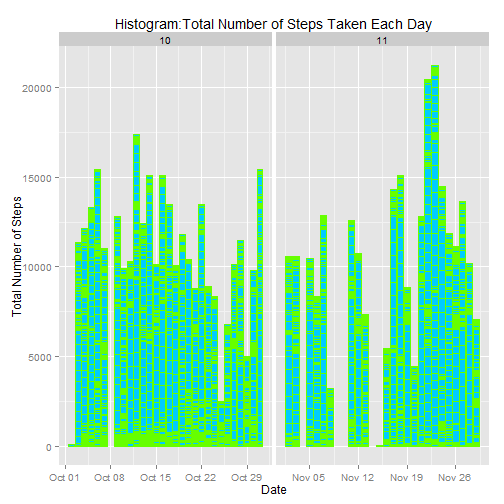
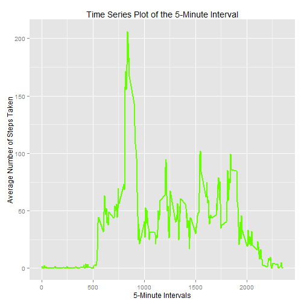
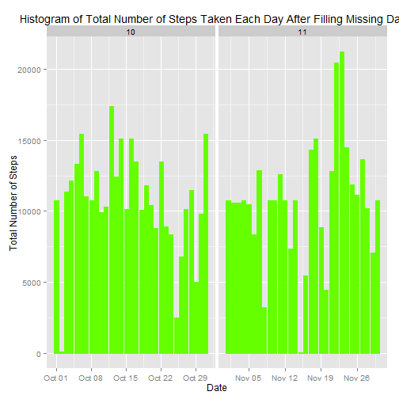

### Loading and processing the data

```r
unzip("C:/Users/Bunmi/Documents/repdata-data-activity.zip")
myData <- read.csv("C:/Users/Bunmi/Documents/activity.csv", colClasses = c("integer", "Date", "factor"))
myData$month <- as.numeric(format(myData$date, "%m"))
noNA <- na.omit(myData)
rownames(noNA) <- 1:nrow(noNA)
str(noNA)
```

```
## 'data.frame':	15264 obs. of  4 variables:
##  $ steps   : int  0 0 0 0 0 0 0 0 0 0 ...
##  $ date    : Date, format: "2012-10-02" "2012-10-02" ...
##  $ interval: Factor w/ 288 levels "0","10","100",..: 1 226 2 73 136 195 198 209 212 223 ...
##  $ month   : num  10 10 10 10 10 10 10 10 10 10 ...
##  - attr(*, "na.action")=Class 'omit'  Named int [1:2304] 1 2 3 4 5 6 7 8 9 10 ...
##   .. ..- attr(*, "names")= chr [1:2304] "1" "2" "3" "4" ...
```

```r
dim(noNA)
```

```
## [1] 15264     4
```


### What is mean total number of steps taken per day?
For this part of the assignment, you can ignore the missing values in the dataset.

* Make a histogram of the total number of steps taken each day

```r
library(ggplot2)
ggplot(noNA, aes(date, steps)) + geom_bar(stat = "identity", colour = "#66FF00", fill = "#00CCFF", width = 0.9) + facet_grid(. ~ month, scales = "free") + labs(title = "Histogram:Total Number of Steps Taken Each Day", y = "Total Number of Steps", x = "Date")
```

 

* Calculate and report the mean and median total number of steps taken per day

Mean of Total Number of Steps Taken Per Day:

```r
Total_steps <- aggregate(noNA$steps, list(Date = noNA$date), FUN = "sum")$x
mean(Total_steps)
```

```
## [1] 10766
```
Median of Total Number of Steps Taken Per Day:-

```r
median(Total_steps)
```

```
## [1] 10765
```

### What is the average daily activity pattern?
* Make a time series plot (i.e. type = "l") of the 5-minute interval (x-axis) and the average number of steps taken, averaged across all days (y-axis)


```r
Avg_steps <- aggregate(noNA$steps, list(interval = as.numeric(as.character(noNA$interval))), FUN = "mean")
names(Avg_steps)[2] <- "mean_of_steps"

ggplot(Avg_steps, aes(interval, mean_of_steps)) + geom_line(color = "#66FF00", size = 0.9) + labs(title = "Time Series Plot of the 5-Minute Interval", x = "5-Minute Intervals", y = "Average Number of Steps Taken")
```

 

* Which 5-minute interval, on average across all the days in the dataset, contains the maximum number of steps?

```r
Avg_steps[Avg_steps$mean_of_steps == max(Avg_steps$mean_of_steps), ]
```

```
##     interval mean_of_steps
## 104      835         206.2
```

### Imputing missing values
* Total Number of Rows With NAs:-


```r
sum(is.na(data))
```

```
## Warning: is.na() applied to non-(list or vector) of type 'closure'
```

```
## [1] 0
```

* Devise a strategy for filling in all of the missing values in the dataset. The strategy does not need to be sophisticated. For example, you could use the mean/median for that day, or the mean for that 5-minute interval, etc.

Strategy: I am using the average 5-minute interval (MEAN), as a strategy to fill missing NAs in the steps.

* Create a new dataset that is equal to the original dataset but with the missing data filled in.


```r
my_newData <- myData 
for (i in 1:nrow(my_newData)) {
    if (is.na(my_newData$steps[i])) {
        my_newData$steps[i] <- Avg_steps[which(my_newData$interval[i] == Avg_steps$interval), ]$mean_of_steps
    }
}

sum(is.na(my_newData))
```

```
## [1] 0
```

* Make a histogram of the total number of steps taken each day and Calculate and report the mean and median total number of steps taken per day. 


```r
ggplot(my_newData, aes(date, steps)) + geom_bar(stat = "identity",
                                             color = "#66FF00",
                                             fill = "#66FF00",
                                             width = 0.8) + facet_grid(. ~ month, scales = "free") + labs(title = "Histogram of Total Number of Steps Taken Each Day After Filling Missing Data)", x = "Date", y = "Total Number of Steps")
```

 

* Do these values differ from the estimates from the first part of the assignment? What is the impact of imputing missing data on the estimates of the total daily number of steps?

Mean of Total Number of Steps Taken Per Day:-

```r
New_total_steps <- aggregate(my_newData$steps, 
                           list(Date = my_newData$date), 
                           FUN = "sum")$x
New_mean <- mean(New_total_steps)
New_mean
```

```
## [1] 10766
```
Median of Total Number of Steps Taken Per Day:-

```r
New_median <- median(New_total_steps)
New_median
```

```
## [1] 10766
```
Compare them with the two before imputing missing data:-

```r
Old_mean <- mean(Total_steps)
Old_median <- median(Total_steps)
New_mean - Old_mean
```

```
## [1] 0
```

```r
New_median - Old_median
```

```
## [1] 1.189
```
After replacing the missing steps (NAs) with the mean of steps, the new mean of total steps taken per day is still same with the old mean. There is however, a slight difference in the new median of total steps taken per day. The new median is greater than the old median.

### Are there differences in activity patterns between weekdays and weekends?

* Create a new factor variable in the dataset with two levels -- "weekday" and "weekend" indicating whether a given date is a weekday or weekend day.


```r
my_newData$weekdays <- factor(format(my_newData$date, "%A"))
levels(my_newData$weekdays) <- list(weekday = c("Monday", "Tuesday",
                                             "Wednesday", 
                                             "Thursday", "Friday"),
                                 weekend = c("Saturday", "Sunday"))
table(my_newData$weekdays)
```

```
## 
## weekday weekend 
##   12960    4608
```

* Make a panel plot containing a time series plot (i.e. type = "l") of the 5-minute interval (x-axis) and the average number of steps taken, averaged across all weekday days or weekend days (y-axis).


```r
Avg_steps <- aggregate(my_newData$steps, 
                      list(interval = as.numeric(as.character(my_newData$interval)), 
                           weekdays = my_newData$weekdays),
                      FUN = "mean")
names(Avg_steps)[3] <- "mean_of_steps"
library(lattice)
xyplot(Avg_steps$mean_of_steps ~ Avg_steps$interval | Avg_steps$weekdays, 
       layout = c(1, 2), type = "l", 
       xlab = "Interval", ylab = "Number of Steps")
```

 
